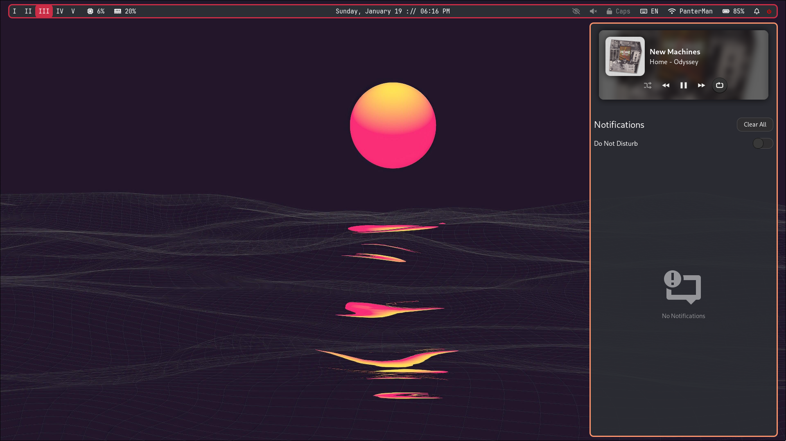

# dotfiles
This is a storage for backup files of my configurations, mostly within Arch Linux.

## Current customization
- OS: Arch Linux
- WM: Hyprland
- Top bar: Waybar
- Notification sidebar: SwayNC
- File manager: Nemo
- App menu: Wofi
- Colorscheme: Sonokai, Retrowave (custom - sonokai-inspired)

### Colors
I like changing things up, so there are a handful of colorschemes I like varying between.

I've decided to make my configs for Hyprland (and its ecosystem), waybar, and wofi semi-modular by splitting off the color-related code sections and placing them into their own files.

Changing the color schemes is as simple as going into the main config file (i.e. hyprland.conf) and changing the source file for the color variables to the name of the colors file (i.e. colors/gruvbox.conf)

The colorschemes are as follows:
- Retrowave - red & purple
- Everforest - green
- Nord - bluish grays
- Gruvbox - retro yellows
